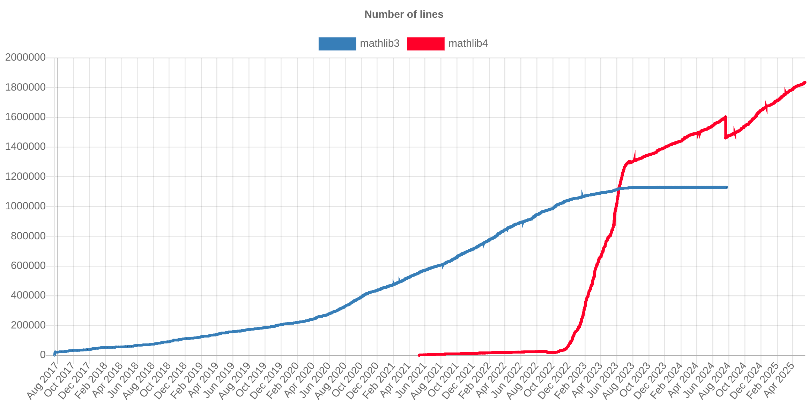

<!-- .slide: data-background="./columnes.jpg" -->

<!-- .h1 {
    /* 1 pixel black shadow to left, top, right and bottom */
    text-shadow: -1px 0 black, 0 1px black, 1px 0 black, 0 -1px black;

    font-family: sans; color: yellow;
} -->
 <h1 style="color:white;text-shadow: -1px 0 black, 0 1px black, 1px 0 black, 0 -1px black;">Lean Bootcamp</h1>

<h3 style="color:white;text-shadow: -1px 0 black, 0 1px black, 1px 0 black, 0 -1px black;">Barcelona</h3>

Marc Masdeu (UAB-CRM) · 14 de maig del 2025

---

## Pla

1. Què és la formalització?
2. Aplicacions
3. Enllaços rellevants
4. Taller
---

## 1. Què és la formalització?

---

### Objectiu

- Fer que l'ordinador "entengui" matemàtiques:

	1. Definicions,
	2. Teoremes, i
	3. Demostracions.

- El compilador *certifica* la validesa dels raonaments.
- Hi ha molts altres llenguatges: Isabelle, HOL Light, Coq, Metamath, Mizar, ProofPower,...
- Ens centrem amb *Lean* (el més popular entre els **matemàtics**).
---

### Lean

**Assistent de demostracions <!-- .element: class="fragment" -->**

1. Enunciar teoremes i demostracions en un llenguatge formal.<!-- .element: class="fragment" -->
2. Automatitza alguns passos (obvis) de la demostració.<!-- .element: class="fragment" -->
3. Verifica la demostració a partir dels axiomes.<!-- .element: class="fragment" -->

**Llenguatge de programació <!-- .element: class="fragment" -->**

1. Les definicions (constructives) es poden convertir en programes C executables.<!-- .element: class="fragment" -->
2. Podem programar estratègies de demostració (tàctiques).<!-- .element: class="fragment" -->
3. Altament extensible (notacions, sintaxi,...).<!-- .element: class="fragment" -->

---

### Història

- 2013: Lean 1.0 (experiment)
- 2015: Lean 2.0 (primera versió oficial).
- 2017: Lean 3.0 (tàctiques). Mathlib.
- 2021: Lean 4 (implementat en Lean, llenguatge de programació genèric).
- 2023: Mathlib4: Mathlib per Lean4.
- 2023: Es crea el Lean FRO, una organització que manté el Lean actualment.

---

### Característiques de LEAN

- Basat en teoria de tipus dependents (DTT)
  - No està basat en teoria de conjunts
- Suporta tàctiques (automatització)
  - Per ara, menys potents que altres sistemes
- Irrellevància de demostracions (si $x$ i $y$ són demostracions de $P$, aleshores $x=y$).
  - No HoTT

---

## 2. Aplicacions

---

### Verificació de resultats matemàtics

El somni del referee!<!-- .element: class="fragment" -->

Exemples:<!-- .element: class="fragment" -->

  * Teorema de Feit-Thompson (Gontier et al 2013)<!-- .element: class="fragment" -->
  * La conjectura de Kepler (Hales et al 2017)<!-- .element: class="fragment" -->
  * Liquid Tensor Experiment (Commelin et al 2022)<!-- .element: class="fragment" -->
  * Conjectura d'Erdös-Graham (Bloom et al 2022)<!-- .element: class="fragment" -->
  * Últim Teorema de Fermat per primers regulars (Birkbeck et al 2023)<!-- .element: class="fragment" -->
  * La conjectura de Freiman-Ruzsa polinòmica (Tao et al 2023)<!-- .element: class="fragment" -->
  * Prime number theorem i FLT (en progrés)<!-- .element: class="fragment" -->

---

### Textos adaptables

- Els textos matemàtics estan escrits per a lectors amb un nivell determinat.<!-- .element: class="fragment" -->
- En el futur, el lector podrà triar el nivell de detall:<!-- .element: class="fragment" -->
<iframe data-src="https://www.imo.universite-paris-saclay.fr/~patrick.massot/Examples/ContinuousFrom.html" 
width=100% height="500" frameborder="0" marginwidth="0" marginheight="0" 
scrolling="yes"  max-width:100%;" allowfullscreen=""></iframe>

---

### Recerca

  * Detectar hipòtesis supèrflues, generalitzacions.<!-- .element: class="fragment" -->
  * Clarificar definicions i arguments (Mochizuki vs Scholze-Stix).<!-- .element: class="fragment" -->
  * Cerca semàntica de resultats: <!-- .element: class="fragment" --> <a target=_blank href=https://loogle.lean-lang.org/>Loogle</a>
  * La IA pot suggerir passos (senzills, per ara), o analogies. <!-- .element: class="fragment" -->
  * Incentivar l'abstracció i neteja idees.<!-- .element: class="fragment" -->

---

### Docència

* A alguns alumnes els costa distingir una demostració correcta d'una d'incorrecta.<!-- .element: class="fragment" -->
* Habitualment, l'única solució passa per consultar un professor (oracle).<!-- .element: class="fragment" -->
  - Amb Lean poden obtenir feedback immediat.<!-- .element: class="fragment" -->
* S'ha utilitzat Lean en la docència en més d'una cinquantena de cursos de tot el món (EUA, França, Alemanya,...)<!-- .element: class="fragment" --> (<a href="https://leanprover-community.github.io/teaching/courses.html" target="_blank">llista</a>).

---

## 3. On som avui?

---

### Mathlib: Una biblioteca unificada de matemàtiques

- Projecte global i lliure.
- S'assumeix lògica clàssica (terç exclòs, axioma de l'elecció).
- Més de $105 \text{K}$ definicions (maig 2025)
- Més de $214\text{K}$ 'teoremes'.
- 576 contribuïdors.

<!-- .element height="60%" width="60%" -->

---

### Mathlib: un resum

- <a href="https://leanprover-community.github.io/undergrad.html" target="_blank">Matemàtiques nivell *undergraduate*</a>
- <a href="https://leanprover-community.github.io/mathlib-overview.html" target="_blank">Què hi ha a Mathlib?</a>
- <a href="https://leanprover-community.github.io/mathlib4_docs/mathlib.html" target="_blank">Visualització</a>

---

<!-- .slide: class="center" -->

---
 ## 3. Enllaços rellevants

- <a href="https://mmasdeu.github.io/leanbootcamp" target="_blank">mmasdeu.github.io/leanbootcamp/slides.html</a>
- <a href="https://leanprover-community.github.io/" target="_blank">Pàgina de Lean Community</a>
- <a href="https://leanprover.zulipchat.com/" target="_blank">Xat de zulip</a> (es demana fer servir el nom real).
- <a href="https://leanprover-community.github.io/mathematics_in_lean/" target="_blank">Mathematics in Lean</a> (llibre).

---

## 4. Taller

Fitxers Lean pel Bootcamp:

- <a href="https://live.lean-lang.org/#url=https%3A%2F%2Fraw.githubusercontent.com%2Fmmasdeu%2FLeanBootcamp%2Frefs%2Fheads%2Fmain%2FLeanBootcamp%2FExercises%2F01Rw.lean" target="_blank">01Rw</a>

- <a href="https://live.lean-lang.org/#url=https%3A%2F%2Fraw.githubusercontent.com%2Fmmasdeu%2FLeanBootcamp%2Frefs%2Fheads%2Fmain%2FLeanBootcamp%2FExercises%2F02Implicacions.lean" target="_blank">02Implicacions</a>

- <a href="https://live.lean-lang.org/#url=https%3A%2F%2Fraw.githubusercontent.com%2Fmmasdeu%2FLeanBootcamp%2Frefs%2Fheads%2Fmain%2FLeanBootcamp%2FExercises%2F03Quantificadors.lean" target="_blank">03Quantificadors</a>

- <a href="https://live.lean-lang.org/#url=https%3A%2F%2Fraw.githubusercontent.com%2Fmmasdeu%2FLeanBootcamp%2Frefs%2Fheads%2Fmain%2FLeanBootcamp%2FExercises%2F04Successions.lean" target="_blank">04Successions</a>

---

